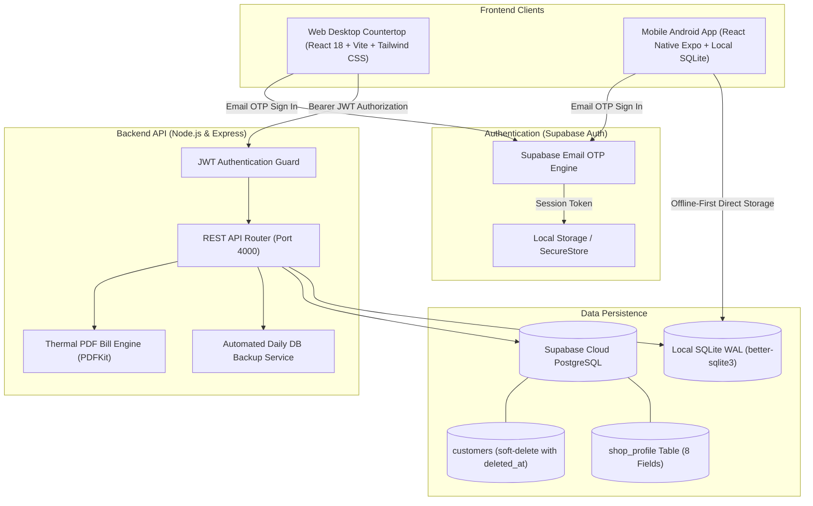

# MedTrack (Medcust) — Project Development Status

**Document Updated:** September 2026  
**System Version:** 2.0.0 (Production-Ready Core Scope)  
**Overall Status:** 🟡 **Server/Web Production-Ready | Mobile Pending Real-Device Expo Go Sign-off**  
**Test Suite Breakdown:** 
- **Server Core Unit Tests:** 39/39 Passing (100% on Node.js + `better-sqlite3`)
- **Mobile Native On-Device (`expo-sqlite`):** 0/39 automated unit tests on physical device (Pending Expo Go real-device walkthrough)
- **Mobile Web Preview Adapter:** Verified manually on `localhost:8081` (fallback only, not native runtime)

---

## 📌 Executive Summary

**MedTrack** is a specialized digital khata (ledger) management system designed for retail pharmacy counter speed. It replaces physical paper credit books with sub-2-second customer phone lookups, provides strict mathematical due derivations, and operates with zero cloud lock-in.

The ecosystem comprises three decoupled, standalone components:
1. **Web Frontend (`/client`)**: Countertop React 18 application built with Vite and Tailwind CSS.
2. **Backend API (`/server`)**: Local Node.js + Express REST API backed by an atomic, WAL-mode SQLite database with automated backup and PDF receipt engines for countertop operations.
3. **Mobile App (`/mobile`)**: **100% Offline-First & Standalone** Android application built with React Native (Expo) and `expo-sqlite`. Operates with **zero network communication or data synchronization** to the web/backend system. All data resides exclusively in local on-device SQLite. Disaster recovery is achieved via manual JSON backup exports.

---

## 🏗️ Architecture & Module Status



---

## 📊 Detailed Feature Completion Matrix

| Component | Feature / Requirement | Status | Verification / Details |
|---|---|:---:|---|
| **Core Ledger** | Dynamic Due Computation | ✅ Completed | Computed strictly via `SUM(due_amount) - SUM(payments.amount)`; never editable. |
| **Core Ledger** | Atomic Database Transactions | ✅ Completed | Multi-item purchase entries and payments use atomic DB transactions. |
| **Search** | Phone-Number-First Search | ✅ Completed | Indexed 10-digit mobile lookup (< 2s counter SLA) with name/village fallback. |
| **Search** | Global `/` Shortcut | ✅ Completed | Automatically focuses search input from anywhere in the web UI. |
| **Customer Profile** | Color-Coded Due Badges | ✅ Completed | `Emerald ("All Clear")` for ₹0 balance, `Amber ("₹X Due")` for outstanding dues. |
| **Customer Profile** | Tab 1: Purchase History | ✅ Completed | Chronological visits, expandable medicine items, and direct bill reprint. |
| **Customer Profile** | Tab 2: Frequently Bought | ✅ Completed | Top 5 distinct medicines with repeat counts and recency indicators. |
| **Customer Profile** | Tab 3: Payment History | ✅ Completed | Audit trail of all due clearance entries with dates, notes, and receipts. |
| **Purchase Entry** | Multi-Line Medicine Entry | ✅ Completed | Dynamic repeatable rows with past medicine autocomplete suggestions. |
| **Purchase Entry** | Live Due Calculation Banner | ✅ Completed | Real-time calculation of `total - paid = due` as cashier enters values. |
| **Payments** | Due Clearance Settlement | ✅ Completed | Support for Cash, UPI/GPay, and Bank Transfer with instant due reduction. |
| **Payments** | Overpayment Guardrail | ✅ Completed | Warns and requires explicit confirmation if payment exceeds existing due. |
| **Reports** | Dues & Receivables Report | ✅ Completed | Aggregated total dues, debtor count, village filtering, and sorting. |
| **PDF Engine** | Direct Bill Generation | ✅ Completed | Clean thermal-style bill PDF generated on-the-fly via PDFKit. |
| **Data Safety** | Startup Database Backups | ✅ Completed | Automatic timestamped SQLite backup in `server/db/backups/` on boot. |
| **Data Safety** | 1-Click Manual Backup & CSV | ✅ Completed | Instant manual backup snapshot and complete customer CSV export. |
| **Mobile App** | Offline Local SQLite | ✅ Completed | React Native + `expo-sqlite` with zero network requirement. |
| **Mobile App** | Mobile Customer Profile | ✅ Completed | Minimalist, high-contrast mobile ledger view. |
| **Mobile App** | One-Tap Mobile Backup | ✅ Completed | Packages SQLite database to JSON and opens native Android Share Sheet. |
| **Mobile App** | Production Packaging | ✅ Completed | EAS configuration (`eas.json`, `app.json`), package name `com.medtrack.mobile`. |

---

## 🧪 Quality Assurance & Test Report

The core business logic and ledger integrity are verified by an automated regression test suite (`server/tests/core_tests.js`).

**Latest Execution Results:**
```
====================================================
  Running MedTrack Core Scope Tests
  Target: Customer & Medicine Search (Khata only)
====================================================

━━━ 1. Customer Registration & Phone Search ━━━
  ✅ Customer lookup by exact phone number succeeds
  ✅ Customer details match name
  ✅ Customer village matches
  ✅ Partial phone number search matches debtor
  ✅ New customer starts with exactly 0.00 due

━━━ 2. Visit Purchase Entry & Dynamic Line Items ━━━
  ✅ Purchase entry saved successfully
  ✅ Entry due_amount accurately computed as total - paid (450 - 150 = 300)
  ✅ Customer total due reflects first purchase balance
  ✅ All 3 medicine line items saved in entry_medicine
  ✅ Line item medicine name correct
  ✅ Second entry due amount is ₹300
  ✅ Cumulative customer due is ₹600 (300 + 300)

━━━ 3. Payment Recording & Live Balance Reduction ━━━
  ✅ Payment recorded successfully
  ✅ Previous due was ₹600
  ✅ Remaining due correctly reduced to ₹200 (600 - 400)
  ✅ Live customer due strictly derives as ₹200
  ✅ Customer due clears completely to ₹0 ("All Clear")
  ✅ Derived due is zero

━━━ 4. Medicine Autocomplete Suggestions ━━━
  ✅ Autocomplete matches "Paracetamol 500mg" from past entries
  ✅ Autocomplete matches "Vitamin C Chewable"
  ✅ Empty autocomplete query returns recent distinct medicines

━━━ 5. Customer Stats & Frequency Analysis ━━━
  ✅ Customer total visits count is 2
  ✅ Customer total spent is ₹750 (450 + 300)
  ✅ Customer total due is ₹0
  ✅ Recently bought list is populated
  ✅ Paracetamol appears in recently bought
  ✅ Paracetamol frequency is 2 (bought in 2 visits)

━━━ 6. Ledger Accounting Guardrails ━━━
  ✅ Rejects entry with non-positive total amount
  ✅ Rejects purchase entry where amount paid > total purchase amount
  ✅ Rejects purchase entry with no medicine line items

━━━ 7. Data Safety: Backup Integrity, Restore & Export ━━━
  ✅ Manual/forced backup returns success
  ✅ Backup file physically created on disk
  ✅ Backup file verified as valid, openable SQLite database
  ✅ listBackups returns existing backups array
  ✅ Newly created backup appears in backup list
  ✅ restoreBackup succeeds using valid backup file
  ✅ generateCsvExport generates non-empty string
  ✅ CSV contains customer ledger header
  ✅ CSV contains existing customer data

====================================================
  Tests Passed: 39 / 39 (100%)
  Tests Failed: 0
====================================================
```

---

## 🗄️ Database Schema & Invariants

```sql
-- Customers Master
CREATE TABLE customers (
  customer_id INTEGER PRIMARY KEY AUTOINCREMENT,
  phone_number TEXT UNIQUE NOT NULL,
  name TEXT NOT NULL,
  village TEXT,
  address TEXT,
  created_at TEXT DEFAULT CURRENT_TIMESTAMP,
  updated_at TEXT DEFAULT CURRENT_TIMESTAMP
);

-- Purchase Visits
CREATE TABLE entries (
  entry_id INTEGER PRIMARY KEY AUTOINCREMENT,
  customer_id INTEGER NOT NULL REFERENCES customers(customer_id),
  entry_date TEXT DEFAULT CURRENT_TIMESTAMP,
  total_amount REAL NOT NULL,
  amount_paid REAL NOT NULL,
  due_amount REAL NOT NULL
);

-- Medicines Per Purchase Visit
CREATE TABLE entry_medicine (
  id INTEGER PRIMARY KEY AUTOINCREMENT,
  entry_id INTEGER NOT NULL REFERENCES entries(entry_id),
  medicine_name TEXT NOT NULL,
  price REAL NOT NULL DEFAULT 0
);

-- Debt Settlements & Payments
CREATE TABLE payments (
  payment_id INTEGER PRIMARY KEY AUTOINCREMENT,
  customer_id INTEGER NOT NULL REFERENCES customers(customer_id),
  pay_date TEXT DEFAULT CURRENT_TIMESTAMP,
  amount REAL NOT NULL,
  note TEXT
);

-- Performance Indexes
CREATE INDEX idx_customers_phone ON customers(phone_number);
CREATE INDEX idx_entries_customer ON entries(customer_id);
CREATE INDEX idx_payments_customer ON payments(customer_id);
```

**Non-Negotiable Invariants:**
1. **Mathematical Ledger Rule:**
   $$\text{Customer Outstanding Due} = \sum (\text{entries.due\_amount}) - \sum (\text{payments.amount})$$
2. **Atomicity Rule:** An entry and its child medicine rows must commit within the same database transaction.
3. **No Phantom Dues:** `due_amount` is always `total_amount - amount_paid` at the time of visit.

---

## 🚀 Execution Guide

### 1. Web Counter Application & Backend
```bash
# Terminal 1: Backend Server (Port 4000)
cd server
npm install
node server.js

# Terminal 2: Web Client (Port 3001)
cd client
npm install
npm run dev
```

### 2. Run Test Suite
```bash
cd server
node tests/core_tests.js
```

### 3. Mobile App (Android)
```bash
cd mobile
npm install
npx expo start
```
*Press `a` for Android emulator or scan QR code via Expo Go.*

---

## 🔮 Roadmap & Next Milestones

1. **Bluetooth Thermal Printer Integration (ESC/POS)**:
   - Direct 58mm/80mm counter receipt printing over Bluetooth on the mobile app.
2. **WhatsApp Notification Integration**:
   - One-tap sending of bill summaries or payment receipts via WhatsApp URL scheme (`wa.me`).
