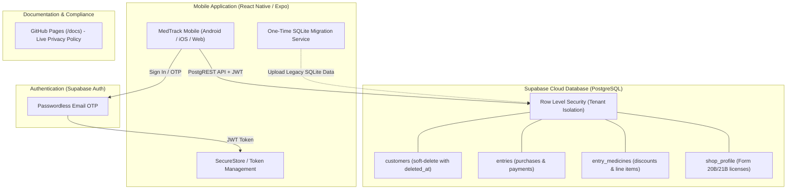

# MedTrack Mobile — Android Pharmacy Khata Ledger

**MedTrack** is a dedicated digital khata (customer dues & purchase ledger) mobile application engineered specifically for retail pharmacy counter speed. Built with **React Native (Expo)** and backed by **Supabase (PostgreSQL with Row Level Security)**, it tracks customer medicine purchases, maintains mathematically derived zero-error due balances, and replaces physical paper credit books.

---

## 🏛️ System Architecture


```mermaid
graph TD
    subgraph Client["Mobile Application (React Native / Expo)"]
        MobileApp["MedTrack Mobile (Android / iOS / Web)"]
        SecureStore["SecureStore / Token Management"]
        LocalMigration["One-Time SQLite Migration Service"]
    end

    subgraph Auth["Authentication (Supabase Auth)"]
        EmailOTP["Passwordless Email OTP"]
    end

    subgraph CloudDB["Supabase Cloud Database (PostgreSQL)"]
        RLS["Row Level Security (Tenant Isolation)"]
        Customers["customers (soft-delete with deleted_at)"]
        Entries["entries (purchases & payments)"]
        EntryMedicines["entry_medicines (discounts & line items)"]
        ShopProfile["shop_profile (Form 20B/21B licenses)"]
    end

    subgraph Compliance["Documentation & Compliance"]
        GHPages["GitHub Pages (/docs) - Live Privacy Policy"]
    end

    MobileApp -->|"Sign In / OTP"| EmailOTP
    EmailOTP -->|"JWT Token"| SecureStore
    MobileApp -->|"PostgREST API + JWT"| RLS
    RLS --- Customers
    RLS --- Entries
    RLS --- EntryMedicines
    RLS --- ShopProfile
    LocalMigration -.->|"Upload Legacy SQLite Data"| RLS
```

---

## 🚀 Key Features

- **Instant Phone-Number Search**:
  - Auto-focused search by 10-digit mobile number, customer name, or village.
  - Active customer results exclude soft-deleted entries by default.
- **Index-Card Customer Profiles**:
  - View name, phone, village, and outstanding balance indicator (`₹X due` or `All clear`).
- **Khata Ledger & Due Derivation**:
  - Chronological history detailing medicines bought, line item discounts, and payments.
  - Running balance is derived dynamically: $\text{Due} = \sum (\text{entries.due\_amount})$. Never stored as an editable column.
- **Distinct Due Payments**:
  - Standalone payments without medicine purchases render with clear green status badges.
- **Multi-Medicine Purchase Entry**:
  - Quick multi-line medicine entry with per-item percentage discounts (`discount_percent`).
- **Recycle Bin (Soft-Delete)**:
  - Deleting a customer moves them to the Recycle Bin with outstanding due warnings.
  - One-tap restore or permanent delete with cascading ledger cleanup.
- **Shop & Pharmacist Credentials**:
  - Manage Form 20B, Form 21B drug licenses, validity dates, and pharmacist registration details.
- **Offline Safeguard & Network Banners**:
  - Non-alarming UI banner when device is offline.
  - Write operations are protected to prevent unsynced data loss.
- **One-Time Local SQLite Upload**:
  - Existing devices with pre-migration offline data can upload all records directly to Supabase under the authenticated pharmacist's account.
- **Full JSON Cloud Backup & Sharing**:
  - Export complete ledger and profile data into standard JSON format with native Android share sheet integration.

---

## 📁 Repository Structure

```text
medtrack/
├── docs/                      # GitHub Pages deployment (Live Privacy Policy)
│   ├── _config.yml
│   └── index.md
├── mobile/                    # React Native / Expo Mobile Application
│   ├── assets/                # App icons, splash screens, and favicon
│   ├── src/
│   │   ├── components/        # Reusable UI components & NetworkBanner
│   │   ├── constants/         # Theme colors, fonts, spacing
│   │   ├── db/                # Supabase Cloud data access layer
│   │   ├── screens/           # Application screens (Home, Profile, Settings, etc.)
│   │   ├── services/          # Auth, migration, network, and export services
│   │   └── utils/             # Khata math, phone cleaning, Supabase client
│   ├── App.js                 # App root & navigation stack
│   ├── app.json               # Expo & Android package configuration
│   ├── eas.json               # Expo Application Services build profiles
│   ├── package.json           # Mobile dependencies & scripts
│   └── supabase_schema.sql    # Complete PostgreSQL schema with RLS
├── LICENSE                    # Apache 2.0 License
└── README.md                  # Project documentation
```

---

## 🛠️ Getting Started

### Prerequisites

- [Node.js](https://nodejs.org/) (v18+)
- [Expo Go](https://expo.dev/go) app installed on your Android or iOS device (for development)

### 1. Install Dependencies

```bash
cd mobile
npm install
```

### 2. Configure Environment Variables

The mobile client is pre-configured with Supabase connectivity. To customize, create a `.env` file in the `mobile` folder:

```env
EXPO_PUBLIC_SUPABASE_URL=https://your-project-id.supabase.co
EXPO_PUBLIC_SUPABASE_ANON_KEY=your-supabase-anon-key
```

### 3. Initialize Supabase Database

Run the SQL script located in `mobile/supabase_schema.sql` inside your **Supabase Dashboard SQL Editor** to create all tables and Row Level Security policies.

### 4. Run Development Server

```bash
cd mobile
npx expo start
```

- **Android / iOS Device**: Open Expo Go and scan the QR code.
- **Web Preview**: Open [http://localhost:8081](http://localhost:8081) directly in your browser.

---

## 📱 Google Play Store & EAS Builds

The application is configured for builds using **Expo Application Services (EAS)**:

1. **Install EAS CLI**:
   ```bash
   npm install -g eas-cli
   eas login
   ```

2. **Build Standalone Android APK (Testing)**:
   ```bash
   cd mobile
   eas build -p android --profile preview
   ```

3. **Build Android App Bundle (.aab for Google Play Console)**:
   ```bash
   cd mobile
   eas build -p android --profile production
   ```

4. **Package Details**:
   - **Package Name**: `com.medtrack.mobile` (configured in `mobile/app.json`)
   - **Privacy Policy**: Deployed via GitHub Pages in the `/docs` folder.

---

## 📄 License

Licensed under the [Apache License, Version 2.0](LICENSE).
